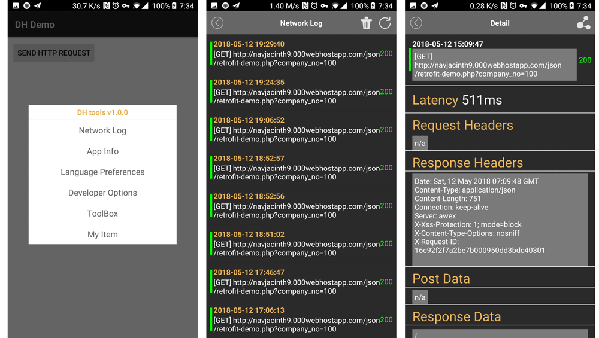

[](https://jitpack.io/#brijoe/DH)
[](https://developer.android.com/guide/topics/manifest/uses-sdk-element.html#ApiLevels)
[](https://docs.gradle.org/current/release-notes)
[](https://www.apache.org/licenses/LICENSE-2.0.html)

# DH 

[Switch to English](README.md)

&nbsp;&nbsp;DH 是一个辅助Android开发的第三方库。此库将一些开发中常见的操作集成在一个弹出窗口中，你只需要摇一摇手机就可以将窗体呼出。你可以快速查看当前App的各项信息，快速进入开发者模式，快速进行语言切换，省去到系统设置中切来切去的麻烦。你甚至可以查看当前App所发出的网络请求信息，轻轻一点，就可以进行复制和分享,免去了手动抓包的步骤，让后端和测试人员都能快速追踪接口，定位问题。

注意：**抓包功能依赖了OKHttp的拦截器，所以要使用这项功能，你的项目必须使用了OKHttp ，不多对于当下的Android 开发来说，OKHTTP 应该是标配了吧~** 




## 开始使用

在Project 级别的bulid.gradle 文件中引入以下配置：

```
	allprojects {
		repositories {
			...
			maven { url 'https://jitpack.io' }
		}
	}
```

在你项目的module级别的 build.gradle文件中引入

```
dependencies {
		 ...
	    implementation 'com.github.brijoe:DH:1.1.1'
	    ...
	}

```
注意：如果你自己的项目中已经引入了OKHttp的拦截器库，那么在编译时可能会遇到冲突，你可以通过以下方式将库内部的依赖排除出去：

```
 implementation ('com.github.brijoe:DH:1.1.1'){
            exclude group: 'com.squareup.okhttp3'
        }

```
在你自己的Application 中加入：

```
public class MyApplication extends Application {

  @Override public void onCreate() {
    	DH.install(this);
  }
}
```
要想查看网络请求，那么你需要在自己的OKHttp拦截器链中加入`DHInterceptor`,DH 库已经帮你处理了存储和展示逻辑。

```
 OkHttpClient.Builder builder = new OkHttpClient.Builder();
        builder.interceptors().clear();
        builder.writeTimeout(30, TimeUnit.SECONDS)
                .connectTimeout(30, TimeUnit.SECONDS)
                //your own interceptor
                .addInterceptor(busInterceptor)
                //add DHInterceptor
                .addInterceptor(new DHInterceptor())
                .readTimeout(30, TimeUnit.SECONDS);

        OkHttpClient client = builder.build();

```


## 接下来
编译运行你的App，摇一摇你的手机，窗口出现了，So easy,哪里不会点哪里~妈妈再也不用担心我的学习了！！！

## 定制化

### 自己处理菜单的显示逻辑 

&nbsp;&nbsp;当你按照以上步骤操作后，菜单窗口默认都是可以通过摇一摇呼出的。但是一般在发布release 版本App时，都要将调试窗口去掉，那么我又不想通过注释代码的方式去掉这个功能，怎么办呢？DH也提供了一个重载方法，`DH.install(context,boolean)`通过传递boolean类型的参数来控制它是否生效，给你充分的自由发挥空间。

```
	DH.install(context,boolean);
```

### 添加自定义的菜单项


如果你对窗口中已有的功能不满意，你也可以加上自己的逻辑。


```
 DH.addDebugger(new Debugger(0,"My Item", new View.OnClickListener() {
            @Override
            public void onClick(View v) {
                Toast.makeText(MyApplication.this,"you click my item",Toast.LENGTH_SHORT).show();
            }
        }));

```


## 最后
如果发现了bug或者有更好的建议，欢迎提issues给我,帮助我完善功能，优化体验。

## License
```
Licensed under the Apache License, Version 2.0 (the "License");
you may not use this file except in compliance with the License.
You may obtain a copy of the License at

   http://www.apache.org/licenses/LICENSE-2.0

Unless required by applicable law or agreed to in writing, software
distributed under the License is distributed on an "AS IS" BASIS,
WITHOUT WARRANTIES OR CONDITIONS OF ANY KIND, either express or implied.
See the License for the specific language governing permissions and
limitations under the License.

```

