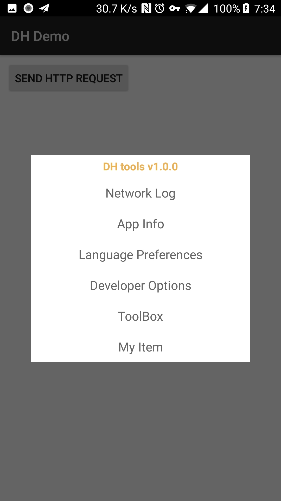
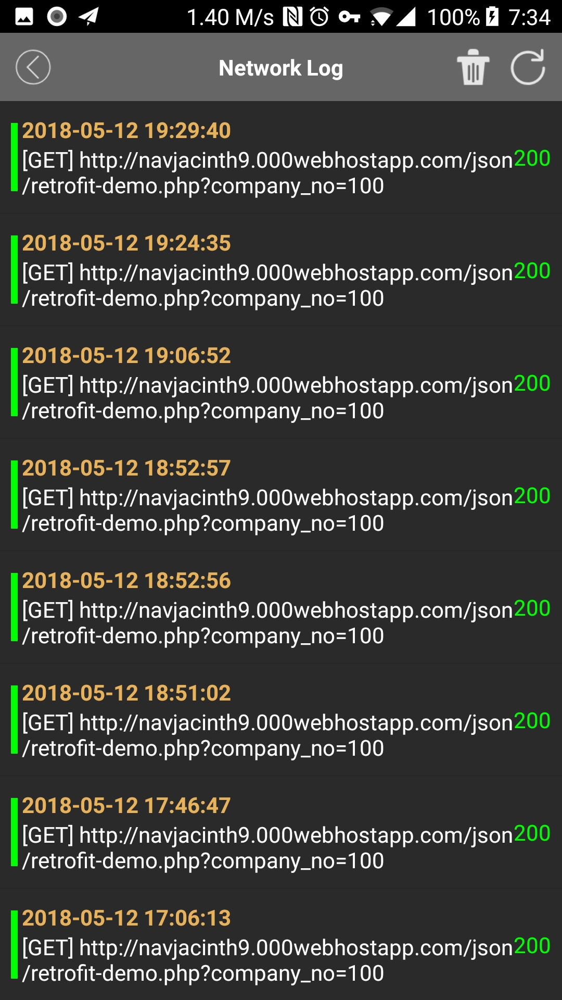
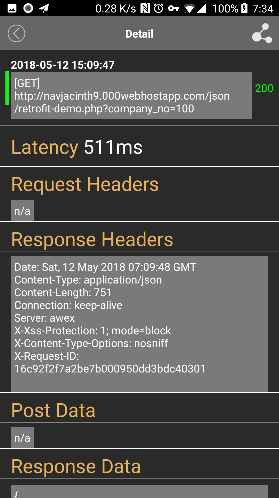

[](https://jitpack.io/#brijoe/DH)

# DH 

A development tools library for Android. 
The library provides you with a quick access portal, you can shake your phone  to show debugging dialog at any time .Even you can watch the app's network log directly.

**Notice:** 
you must use OKHttp library to perform network request,because the DH libary depends on OkHttp Interceptor.






{:height="180px" width="320px"}
{:height="180px" width="320px"}
{:height="180px" width="320px"}

## Getting started


Add it in your root build.gradle at the end of repositories:

```
	allprojects {
		repositories {
			...
			maven { url 'https://jitpack.io' }
		}
	}
```

In your module build.gradle:

```
dependencies {
		 ...
	    implementation 'com.github.brijoe:DH:1.0.0beta'
	    ...
	}

```
In your Application class:

```
public class MyApplication extends Application {

  @Override public void onCreate() {
    	DH.install(this);
  }
}
```
Want to watch the network log of your app ?add the `DHInterceptor` to the Interceptor chains.


```
 OkHttpClient.Builder builder = new OkHttpClient.Builder();
        builder.interceptors().clear();
        builder.writeTimeout(30, TimeUnit.SECONDS)
                .connectTimeout(30, TimeUnit.SECONDS)
                //your own interceptor
                .addInterceptor(busInterceptor)
                //add DHInterceptor
                .addInterceptor(new DHInterceptor())
                .readTimeout(30, TimeUnit.SECONDS);

        OkHttpClient client = builder.build();

```


## Next
Now shake your phone，and the dialog will show up.

## Customize 

you can also add your menu item to the dialag if you are not satisfied with it.


```
 DH.addDebugger(new Debugger("My Item", new View.OnClickListener() {
            @Override
            public void onClick(View v) {
                Toast.makeText(MyApplication.this,"you click my item",Toast.LENGTH_SHORT).show();
            }
        }));

```

## License
```
Copyright 2015 Square, Inc.
Licensed under the Apache License, Version 2.0 (the "License");
you may not use this file except in compliance with the License.
You may obtain a copy of the License at

   http://www.apache.org/licenses/LICENSE-2.0

Unless required by applicable law or agreed to in writing, software
distributed under the License is distributed on an "AS IS" BASIS,
WITHOUT WARRANTIES OR CONDITIONS OF ANY KIND, either express or implied.
See the License for the specific language governing permissions and
limitations under the License.

```

